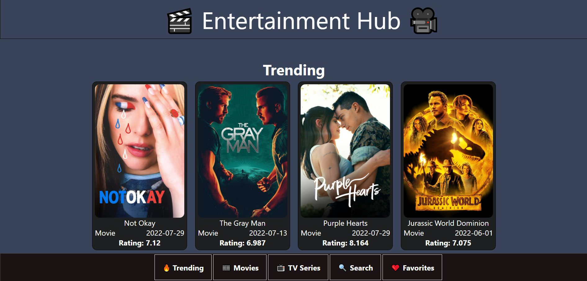
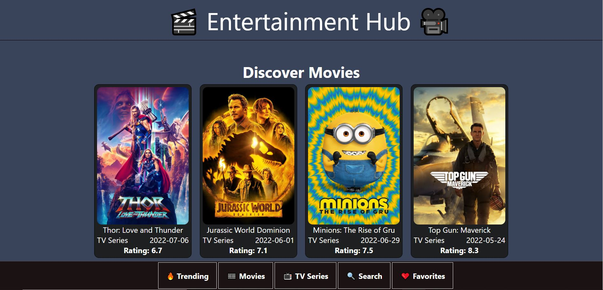
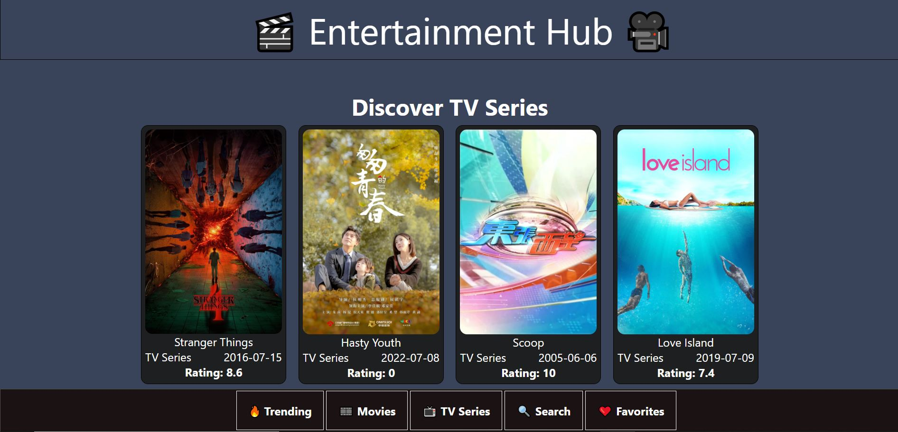
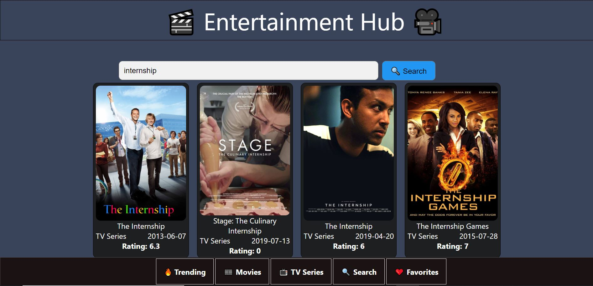
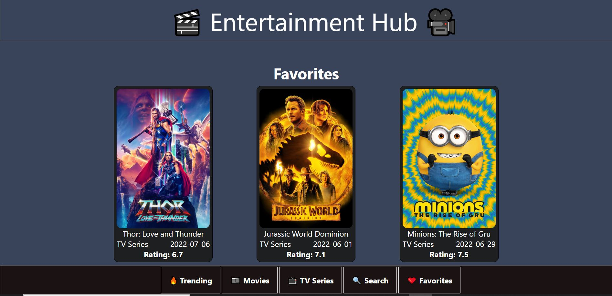

# React Entertainment Hub
 ## By Bonface Masira
## Screenshot
 
 
 
 
 

 ## Table of Content
 - [Description](#description)
 - [Features](#features)
 - [Behaviour Driven Development](#Behaviour-Driven-Development)
 - [Requirements](#requirements)
 - [Installation Process](#installation-Process)
 - [Live Link](#Live-Link)
 - [Backend Repository](#backend-repository)
 - [Technology  Used](#technology-Used)
 - [Authors Info](#Authors-Info)

## Description

The Entertainment Hub  is a React Project that allows users to view Movies and TV Shows. The user is able to view ratings, poster, and release date on the Movies and TV Shows. Users are able to search for Movies and TV shows. Users are also able to create a list of Favorite Movies and TV Shows.

## Features
As a user of the application, you will be able to :
1. View Movies and TV Shows on different pages
2. Search Movies and TV Shows
3. Open a Movie or TV Show to see more information
4. Add Movies and TV Shows to Favoriites Pages

## Behaviour Driven Development|
| Behaviour      | Input        | Output       |
| :------------- | :----------: | -----------: |
|  Enter your name  |   Bonface Masira |     |
| Enter your Email Address  | bonface.masira@student.moringaschool.com |   |
| Enter your message or comment   |  I would like to inquire about something     |     |
| Press Submit|     |Pop up "Bonface Masira , we have received your message. Thank you for reaching out to us.|

 ###  Requirements
 * Access to  a computer or any other garget
 * Access to internet

 ### Installation Process
 ****
* Clone to this repo : git clone https://github.com/bonfacemasira/entertainment-hub
* Unzip the downloaded files in a folder of choice.
* Open the index file from the zipped file with any browser.
 ****

### Live Link
- Click this link to view the live application https://entertainment-hub-v1.herokuapp.com/

### Backend Repository
- Click this link to view the live application https://github.com/bonfacemasira/json-server-template

### Technology  Used
* HTML - which was used to develope the structure of the web application
* CSS - which was used to style the web pages
* JavaScript - which was used for adding functionality to the web page elements.
* React - is the framework which was used to create the components.

## Known Bugs
* None at the moment.

## Author Info
Slack Profile - [Bonface Masira](https://app.slack.com/client/T0101L740P4/C010E0J8BRA/user_profile/U03DNHF0QKA)
LinkedIn - [Bonface Masira](https://www.linkedin.com/in/bonface-masira-975447a4)